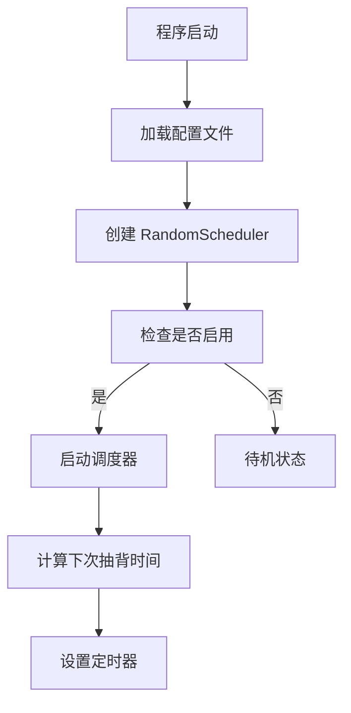
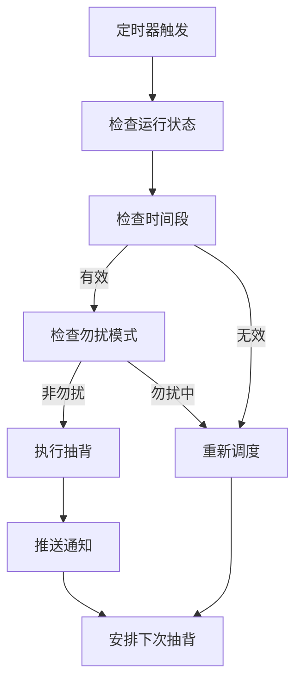
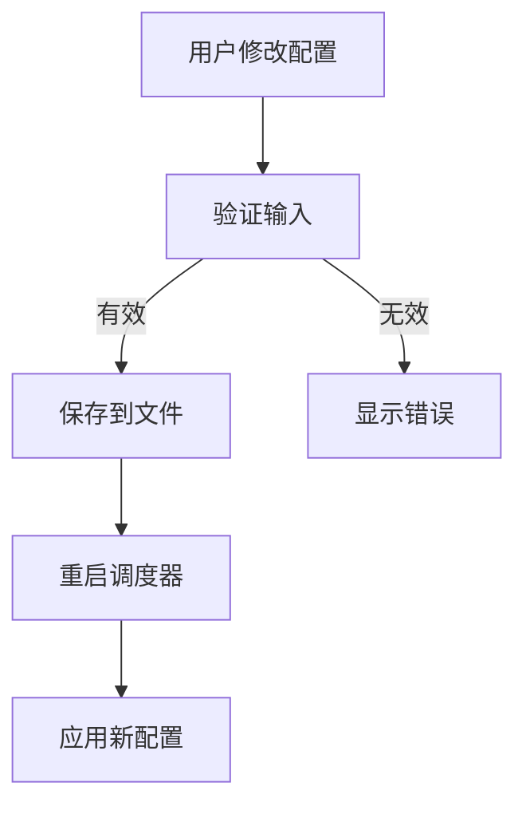

# ToastFish 随机抽背功能技术文档

## 🏗️ 架构设计

### 整体架构
```
┌─────────────────────────────────────────────────────────────┐
│                    ToastFish 主程序                          │
├─────────────────────────────────────────────────────────────┤
│  MainWindow (主窗口)                                        │
│  ├── ScheduleConfig (配置管理)                               │
│  └── RandomScheduler (调度器)                               │
├─────────────────────────────────────────────────────────────┤
│  RandomScheduleSettings (设置界面)                          │
│  ├── 用户界面控件                                           │
│  ├── 数据绑定                                               │
│  └── 事件处理                                               │
├─────────────────────────────────────────────────────────────┤
│  核心组件                                                   │
│  ├── ScheduleConfig (配置类)                                │
│  ├── RandomScheduler (调度器类)                             │
│  └── RandomScheduleTest (测试类)                            │
├─────────────────────────────────────────────────────────────┤
│  现有组件集成                                               │
│  ├── PushWords (单词推送)                                   │
│  ├── Select (数据查询)                                      │
│  └── 通知系统                                               │
└─────────────────────────────────────────────────────────────┘
```

## 📁 文件结构

### 新增文件
```
ToastFish/
├── Model/
│   └── RandomSchedule/
│       ├── ScheduleConfig.cs          # 配置管理类
│       └── RandomScheduler.cs         # 调度器核心类
├── View/
│   ├── RandomScheduleSettings.xaml    # 设置界面 XAML
│   └── RandomScheduleSettings.xaml.cs # 设置界面代码
├── Test/
│   └── RandomScheduleTest.cs          # 测试类
├── 随机抽背功能说明.md                 # 用户文档
└── 随机抽背技术文档.md                 # 技术文档
```

### 修改文件
```
ToastFish/
├── View/
│   └── ToastFish.xaml.cs              # 主窗口集成
└── ToastFish.csproj                   # 项目文件更新
```

## 🔧 核心类详解

### 1. ScheduleConfig 类

**职责**: 管理随机抽背的所有配置参数

**主要属性**:
```csharp
public class ScheduleConfig : INotifyPropertyChanged
{
    public bool IsEnabled { get; set; }                    // 是否启用
    public TimeSpan StartTime { get; set; }                // 开始时间
    public TimeSpan EndTime { get; set; }                  // 结束时间
    public int MinIntervalMinutes { get; set; }            // 最小间隔
    public int MaxIntervalMinutes { get; set; }            // 最大间隔
    public bool IsDoNotDisturbEnabled { get; set; }        // 勿扰模式
    public TimeSpan DoNotDisturbStart { get; set; }        // 勿扰开始
    public TimeSpan DoNotDisturbEnd { get; set; }          // 勿扰结束
}
```

**核心方法**:
- `IsInActiveTimeRange()`: 检查当前是否在活动时间段
- `IsInDoNotDisturbTime()`: 检查当前是否在勿扰时间段
- `GetNextRandomInterval()`: 生成随机间隔时间
- `GetDelayToNextActiveTime()`: 计算到下次有效时间的延迟
- `SaveToFile()` / `LoadFromFile()`: 配置持久化

### 2. RandomScheduler 类

**职责**: 核心调度逻辑，管理定时器和抽背执行

**主要属性**:
```csharp
public class RandomScheduler : IDisposable
{
    private Timer _timer;                           // 系统定时器
    private ScheduleConfig _config;                 // 配置引用
    private volatile bool _isRunning;               // 运行状态
    private volatile bool _disposed;                // 释放状态
    private readonly object _lockObject;            // 线程同步锁
    private DateTime? _nextScheduledTime;           // 下次调度时间
}
```

**核心方法**:
- `Start()`: 启动调度器
- `Stop()`: 停止调度器
- `Restart()`: 重启调度器（配置更改后）
- `ScheduleNext()`: 安排下一次抽背
- `OnTimerCallback()`: 定时器回调处理
- `ExecuteRandomRecitation()`: 执行抽背逻辑
- `TriggerManualRecitation()`: 手动触发抽背

### 3. RandomScheduleSettings 类

**职责**: 用户设置界面，提供配置修改和状态监控

**主要功能**:
- 数据绑定到 ScheduleConfig
- 实时状态更新
- 输入验证
- 配置保存

## ⚡ 性能优化

### 1. 线程安全设计
- 使用 `volatile` 关键字标记状态变量
- 采用 `lock` 机制保护临界区
- 定时器回调中的异常处理

### 2. 资源管理
- 实现 `IDisposable` 接口
- 正确释放 Timer 资源
- 避免内存泄漏

### 3. 算法优化
- 高效的时间计算算法
- 最小化不必要的计算
- 缓存下次调度时间

## 🔄 工作流程

### 启动流程


### 抽背执行流程


### 配置更新流程


## 🧪 测试策略

### 1. 单元测试
- 配置类的各种时间计算方法
- 调度器的启停逻辑
- 边界条件测试

### 2. 集成测试
- 与现有抽背系统的集成
- 通知系统的兼容性
- 配置持久化测试

### 3. 压力测试
- 长时间运行稳定性
- 频繁配置更改
- 异常情况处理

## 🔒 安全考虑

### 1. 输入验证
- 时间格式验证
- 数值范围检查
- 配置文件格式验证

### 2. 异常处理
- 定时器异常恢复
- 文件操作异常
- 线程同步异常

### 3. 资源保护
- 防止资源泄漏
- 线程安全保证
- 配置文件保护

## 📊 性能指标

### 内存使用
- 基础内存占用: ~2MB
- 运行时额外占用: ~500KB
- 配置文件大小: ~1KB

### CPU 使用
- 空闲状态: 0%
- 调度计算: <0.1%
- 抽背执行: <0.5%

### 响应时间
- 配置保存: <100ms
- 调度器启停: <50ms
- 抽背触发: <200ms

## 🔮 扩展性设计

### 1. 插件化支持
- 抽背内容提供者接口
- 通知样式扩展
- 统计数据收集

### 2. 配置扩展
- 多时间段支持
- 复杂调度规则
- 个性化设置

### 3. 平台扩展
- 跨平台支持准备
- 云同步接口预留
- 移动端适配考虑

## 📝 开发规范

### 代码风格
- 遵循 C# 编码规范
- 使用有意义的命名
- 充分的注释说明

### 错误处理
- 使用 try-catch 包装关键操作
- 记录详细的调试信息
- 优雅的错误恢复

### 文档要求
- 公共接口必须有 XML 注释
- 复杂算法需要详细说明
- 配置参数需要使用示例

---

**维护者**: ToastFish 开发团队  
**最后更新**: 2024年  
**版本**: v1.0.0
